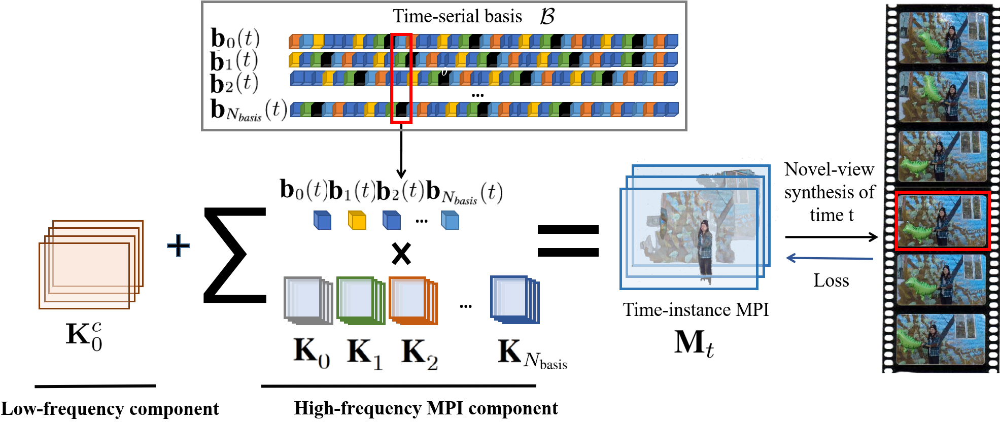

## Temporal-MPI: Enabling Multi-Plane Images for Dynamic Scene Modelling via Temporal Basis Learning
#### [Wenpeng Xing](https://Derry-Xing.github.io/)1, [Jie Chen](https://jchenhkg.github.io/)1  
####  1Department of Computer Science, Hong Kong Baptist University  
#### [Code](https://github.com/TigerYuHuzi/Temporal_MPI)
#### This repository contains the implementation of ECCV 2022 paper: Temporal-MPI.

## Overall Pipeline

## Demonstration Video

